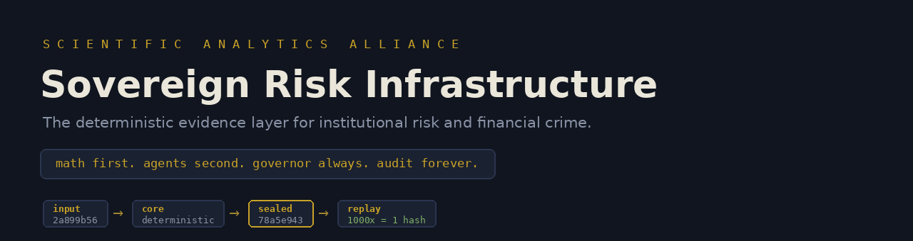

<p align="center">
  
</p>

# 👋 Hi, I'm Oleksii Slieptsov

### 🏛️ Founder @ Scientific Analytics Alliance | CFA | Ex-PrivatBank Treasury & Liquidity | SSRN Author | NVIDIA Inception Member

#### ⚡ Sovereign Risk Infrastructure - the deterministic evidence layer for institutional risk & financial crime

**📍 Based in Spain** | **🌐 [saa-alliance.com](https://saa-alliance.com)** | **📬 o.slieptsov@saa-alliance.com**

```text
math first. agents second. governor always. audit forever.
```

---

## 🏛️ The Company - Scientific Analytics Alliance

**Delaware C-Corp · NVIDIA Inception member · seven product surfaces, one evidence discipline**

Every number our systems emit is **reproducible by hash**: same input bytes → same sealed hash, on rerun, on another machine, months later. Missing data prints `WITHHELD` with an unlock path - never an invented metric. An automated **governor** gates every release: it recently auto-held an overfit optimizer Sharpe of 10.4, because the system refuses its own best-looking number.

| 🧩 Surface | What it delivers |
|---|---|
| 🌍 **Global Risk Intelligence** | Physical-to-financial shock translation: sovereign, market & contagion scenarios · five tail estimates reconciled with explicit roles · evidence hold-packets when data fails |
| 📊 **SAA Risk Analyzer** | Portfolio VaR/CVaR/ES · 22-scenario stress catalog · pre-trade risk gate · fail-closed governance with hash-chained audit ledgers |
| 📈 **Investment Analytics** | Equity & portfolio research verdicts on typed metric registries and decision snapshots |
| 🪙 **Digital Assets Analytics** | Crypto-domain scoring · treasury runway stress · execution-adjusted rebalance analysis |
| 📰 **News Analytics** | Narrative signals feeding governed risk context - AI reads the news, but never authors the numbers |
| 🕵️ **KOKON Forensic & CFO Governance** | AML/forensic case packs (sanctions, OFAC 50% aggregation, typology matrices, SAR firewall) · CFO value-leakage packs on a 12-layer typed value model |
| 🤖 **Know-Your-Agent (KYA)** | Oversight for deployed AI agents: mandate coverage, out-of-mandate value, delegation depth, agent-action replay |

### 🔢 By the numbers - real, replayable, boundary-labeled

| Metric | Value |
|---|---|
| 🧠 Knowledge graph | **142M nodes · 448M relationships · 9.1M RAG chunks** (live counters) |
| 🎲 Simulated paths, D=200 lane | **1.344 trillion** GPU+CPU paths (200 portfolios × 28 scenarios × 4 horizons) |
| 🔁 Determinism proof | **1,000 fresh-process repeats → 1 unique hash · 0.0% drift** |
| ⚡ Canon 10M lane | Tick p99 **0.44-0.46 ms** · pre-trade gate p99 **0.85-0.93 ms** *(internal bands only - not STAC-certified, not wire-to-wire)* |
| 🎯 GPU/CPU tail parity | CVaR99.9 p95 **0.27-0.28%** across 72B paths/backend |
| 🏋️ Benchmark hardware | **8×H100** in an NVIDIA-provided environment - *production is CPU-native* |
| 📚 Research | **15-paper SSRN series** · methods public |
| 🏁 External benchmark | TCPD change-point: **rank 6/15 on the honest frame** - answer sheets public, third-party replayable |

---

## 🧠 The Core - ARIN22 Kernel & Governance Stack

Every surface above runs on the same four-layer core. Products change; the discipline does not.

```text
┌────────────────────────────────────────────────────────────────────┐
│                     SEVEN PRODUCT SURFACES                         │
│     sealed decision packs · verify-by-hash · claim boundaries      │
└───────────────────────────────▲────────────────────────────────────┘
                                │
┌──────────────┐    ┌───────────┴────────────────┐    ┌──────────────┐
│  🧠 BRAIN     │───▶│   ⚙️ ARIN22 MATH KERNEL    │◀───│  🔗 FABRIC    │
│ knowledge    │    │  deterministic · CPU-native│    │  governed    │
│ substrate    │    │  frozen canon ·            │    │  dispatch ·  │
│ 142M nodes   │    │  NO_KERNEL_MUTATION        │    │  signed      │
│ 448M edges   │    └───────────┬────────────────┘    │  verdicts    │
│ 9.1M RAG     │                │ verdicts             └──────────────┘
└──────────────┘   ┌────────────▼───────────────────────┐
                   │  🏛️ ARIN COUNCIL · GOVERNOR         │
                   │  22-agent governed narrative layer │
                   │  snapshot binding · verdict archive│
                   │  fail-closed gates · custody ledger│
                   └────────────────────────────────────┘
```

| Layer | What it is |
|---|---|
| ⚙️ **ARIN22** - the math kernel | Embeddable deterministic risk-computation layer under a formal operator contract with governed extension lanes - **kernel construction, thresholds and convergence detail stay in the protected dossier (NDA / patent track)**. Engines: EVT/POT (GPD, Hill) · jump-diffusion (Merton + Hawkes + regime switching) · deterministic Lévy/Merton via COS · Eisenberg-Noe clearing + DebtRank · Kirchhoff flow-conservation taint · Tarjan cycles · Benford · OFAC 50% recursive aggregation · 26-factor model + PCA · Almgren-Chriss impact · GARCH/FHS/KDE. Production kernel is **frozen canon**: lanes extend it, nothing mutates it. |
| 🏛️ **ARIN Council** - governance & evidence | The 22-agent governed narrative layer: agents propose, the deterministic core disposes. Snapshot binding, verdict archive, claim-boundary ledger, quorum rules (fallback agents excluded from consensus), review workflows. Validation battery published with power-aware honesty: Kupiec · Christoffersen · Acerbi-Szekely · PIT · EVT-fit - low-power results print `INCONCLUSIVE`, never green. |
| 🔗 **FABRIC** - governed dispatch | The transport of trust: signed verdicts, pinned keys, idempotent envelopes, SLA state machines, append-only custody. Same contract whether the fabric is ours or a partner platform - the core never knows the difference. |
| 🧠 **BRAIN** - knowledge substrate | 142M-node / 448M-relationship graph + 9.1M RAG chunks: sanctions lists, legal & registry layers, adverse media, market & macro series, point-in-time vintages. Capacity and per-run utilization reported separately - "100% capacity, 0 rows retrieved" is a printable, honest state. |

---

## 🎯 About Me

- 🏦 **Background**: Treasury & Liquidity at PrivatBank (Ukraine's largest bank) - intraday liquidity, funding, and numbers that face auditors and regulators
- 🎓 **CFA charterholder** · **SSRN author**: [6749503](https://papers.ssrn.com/sol3/papers.cfm?abstract_id=6749503) · [6893318](https://papers.ssrn.com/sol3/papers.cfm?abstract_id=6893318)
- 🔭 **Building**: the full SAA stack - ARIN22 deterministic kernel → ARIN Council governor → FABRIC governed dispatch → BRAIN knowledge substrate → seven product surfaces
- 🤖 **Method**: solo founder operating a governed agent fleet - agents build the product, agents assist inside it, **agents never author numbers**, and the product audits agents
- 💬 **Ask me about**: deterministic risk computation, EVT/tail modeling, multi-agent governance, treasury & liquidity, AML/sanctions analytics
- ⚡ **Fun fact**: our governor once blocked our own best result - an optimizer Sharpe of 10.445 - as overfit. The refusal *is* the product.

---

## 🛠️ Tech Stack

### AI & Compute


### Backend & Data


### Frontend & Mobile


### Infrastructure & NVIDIA


> 🖥️ Production compute is **CPU-native and air-gap friendly**; GPU lanes exist as benchmark evidence.

---

## 🚀 Featured Projects

### 🤖 ARIN Platform - Autonomous Risk Intelligence Network
Multi-agent risk intelligence with governed dispatch: specialized agents coordinate over a deterministic kernel, every verdict signed and archived, cascade detection over real graph topologies. Working system · review-only discipline.
🔗 [Repository](https://github.com/SAA-Alliance/ARIN-Platform-Autonomous-Research-Intelligence) | **Stack**: Python, FastAPI, PyTorch Geometric, PostgreSQL, Redis, Next.js 14, TypeScript, D3.js | **NVIDIA**: NVIDIA API, GPU-ready GNN architecture

### 🌍 Global Risk Intelligence Platform
Scenario translation engine: applies sovereign/market/contagion shock templates to any city or country, reconciles five tail estimates with explicit roles, and refuses to publish when evidence substrate fails (hold-packets). Working system · review-only.
🔗 [Repository](https://github.com/SAA-Alliance/Global-Risk-Intelligence-Platform) | **Stack**: Python, FastAPI, PostgreSQL, Redis, React, TypeScript | **NVIDIA**: NVIDIA API, NIM integration

### 📊 SAA Risk Analyzer - Portfolio Risk Analytics
Institutional portfolio risk: VaR/CVaR (historical, parametric, Monte Carlo 10M-path lane), 22-scenario stress catalog, pre-trade ALLOW/REVIEW/BLOCK gate with hash-chained ledger, suppression-inheritance governance. Working system · review-only.
🔗 [Repository](https://github.com/SAA-Alliance/SAA-Risk-Analyzer-Portfolio-Risk-Analytics) | **Stack**: Go 1.22+, Python, JAX, CuPy, FastAPI, PostgreSQL+TimescaleDB | **NVIDIA**: CUDA Python, RAPIDS, TensorRT, cuGraph

### 🕵️ KOKON - Forensic, CFO & Know-Your-Agent Governance *(private core)*
Financial-crime case packs (typology matrices, OFAC 50% aggregation, amount additivity by transaction_id, SAR decisions physically separated in a restricted annex), CFO value-leakage packs, and agent-oversight reports. Two-hash determinism: fixture seal + content seal.
🔒 Private · evidence surfaces public via [saa-alliance.com](https://saa-alliance.com) | **Stack**: Python, deterministic composers, append-only gov-ledger

### 📰 News Analytics AI
Financial news intelligence: RSS ingestion → AI analysis with sentiment detection → automated digests. Narrative context for risk systems - explicitly barred from authoring numbers.
🔗 [Repository](https://github.com/SAA-Alliance/News-Analytics-AI-) | **Stack**: Python, FastAPI, SQLite WAL, APScheduler | **NVIDIA**: NVIDIA API, Nemotron Retriever NIM, Nemotron OCR/NER

### 💰 Analytics Portal - Digital Asset Research
Real-time crypto analytics: market metrics, AI sentiment, regulatory mapping, comparative frameworks. Working system.
🔗 [Repository](https://github.com/SAA-Alliance/Analytics-Portal-Digital-Asset-Research-Comparative-Analytics-Platform) | **Stack**: Go 1.22, Gin, React 18, TypeScript, WebSocket | **NVIDIA**: NVIDIA API sentiment models

### 📈 Investment Dashboard - Equity Analytics
Equity research and portfolio analytics workbench: real-time data, charting, portfolio analysis. Working system.
🔗 [Repository](https://github.com/SAA-Alliance/Investment-Dashboard-Institutional-Grade-Equity-Analytics-Platform) | **Stack**: Python, Flask 3.0+, Pandas, NumPy | **NVIDIA**: NVIDIA API insights

### 🤖 AI-Trader - Research & Simulation
Intraday crypto research environment: real-time market data, risk management, backtesting. Research & simulation - not an execution venue.
🔗 [Repository](https://github.com/SAA-Alliance/AI-Trader-Research-Simulation) | **Stack**: Python, FastAPI, PostgreSQL, Redis, WebSocket

### 💧 Liquidity Positioner AI
Liquidity management and position optimization - cross-platform mobile app. Working prototype.
🔗 [Repository](https://github.com/SAA-Alliance/LiquidityPositioner-AI) | **Stack**: Dart, Flutter

### 🎓 SAA Learning Intelligence
Adaptive learning platform for financial analytics and risk management professionals.
🔗 [Repository](https://github.com/SAA-Alliance/SAA-LEARNING-INTELLIGENCE) | **Stack**: TypeScript, React, Next.js

### 🔮 AI-Powered Prediction Market Protocol
AI-native prediction market with LMSR market making and multi-contract governance. Proof-of-concept.
🔗 [Repository](https://github.com/SAA-Alliance/AI-Powered-Prediction-Market-Protocol) | **Stack**: Solidity, Foundry, Next.js 14, The Graph

---

## 🔬 Public, Replayable Evidence

- 🏁 **[tcpd-external-benchmark](https://github.com/SAA-Alliance/tcpd-external-benchmark)** - pinned commits + published answer sheets; any third party replays our scores with TCPDBench `metrics.py`, no SAA code needed
- 📚 **SSRN methods**: [Low-latency stress testing (6749503)](https://papers.ssrn.com/sol3/papers.cfm?abstract_id=6749503) · [DRCET tail-equivalence (6893318)](https://papers.ssrn.com/sol3/papers.cfm?abstract_id=6893318)
- 🕸️ **Systemic-risk research on real public graphs**: BIS banking claims (3,524 edges) · EBA 2025 (63 banks) · SEC 13F (577K holding edges, 4 quarters) · FFIEC ownership topology (33K edges)
- 🏛️ **EBA 2025 / Fed DFAST 2025 adapters**: public-input capital-path deltas with kernel replay checks - full model parity honestly `WITHHELD`

### 🛡️ The discipline (what we will NOT claim)

> ❌ No realized backtest `PASS` before 250 matched observations · ❌ No STAC certification · ❌ No regulator endorsement · ❌ No execution authority · ✅ Suppressed metrics never reprinted under another label · ✅ Synthetic fixtures always carry a synthetic banner · ✅ If a number can't be replayed to its sealed hash - that's a defect: report it

---

## 📊 GitHub Stats

<p align="center">
  
  
</p>

<p align="center">
  
</p>

---

## 🏆 Key Achievements

- 🎯 **NVIDIA Inception Program** - member
- 🧮 **Deterministic math kernel** - EVT/POT, jump-diffusion (Merton+Hawkes), Eisenberg-Noe clearing, DebtRank, Kirchhoff taint, OFAC 50% aggregation, 26-factor model, operator-splitting (measured order 2.00)
- 🔁 **Byte-level reproducibility** - 1,000 fresh-process repeats, 1 unique hash
- 🏦 **Ex-PrivatBank** - Treasury & Liquidity at Ukraine's largest bank
- 📚 **SSRN 15-paper series** - methods public, kernel construction protected
- 🎲 **1.344T simulated paths** in the D=200 high-dimensional evidence lane
- 🏋️ **8×H100 benchmark evidence** by SAA in an NVIDIA-provided environment - production CPU-native

---

## 🤝 Connect

[](https://saa-alliance.com)
[](mailto:o.slieptsov@saa-alliance.com)
[](https://papers.ssrn.com/sol3/papers.cfm?abstract_id=6749503)

---

<div align="center">

### ⭐️ Star the repos if the discipline resonates - and try to break a hash 😉


**`math first. agents second. governor always. audit forever.`**

</div>
